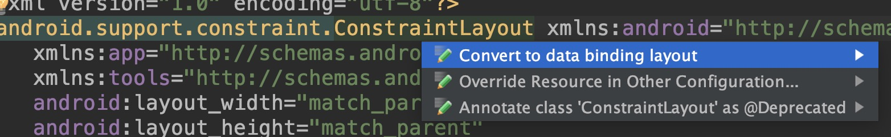

## Android data binding库使用
Android data binding库允许你使用声明性格式而不是以编程方式将布局中的UI组件绑定到应用程序中的数据源。

这个demo中你将学到如何使用这个库。

可以直接下载我github上的源码作参考

下面开始学习。

### 启用data binding库
`build.gradle`

	android {
	...
	    dataBinding {
	       enabled true
	    }
	}

编辑gradle文件后请同步gradle配置。

然后进入Activity所在布局文件中，现在你的布局文件代码应该类似下面这样：

	<?xml version="1.0" encoding="utf-8"?>
	<android.support.constraint.ConstraintLayout >
	    ... 	
	</android.support.constraint.ConstraintLayout>
光标放在根布局，也就是`android.support.constraint.ConstraintLayout`上，`Alt + Enter`快捷键，将会有

可将布局转换成这样：

	<?xml version="1.0" encoding="utf-8"?>
	<layout xmlns:android="http://schemas.android.com/apk/res/android"
	    xmlns:app="http://schemas.android.com/apk/res-auto"
	    xmlns:tools="http://schemas.android.com/tools">
	
	    <data>
	
	    </data>
	
	    <android.support.constraint.ConstraintLayout>
	
			...
	
	    </android.support.constraint.ConstraintLayout>
	</layout>
	
其中`data`标签中将用来编写绑定库的布局表达式。

### 数据单向绑定